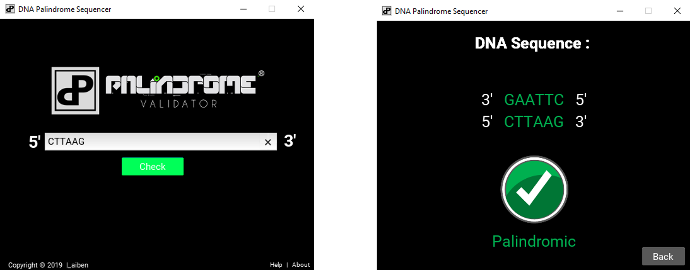

# palindrome-DNA-Sequence-Validator
A program that takes the sequence of a single DNA strand from the user and generates the complimentary base pair, hence forming the DNA helix sequence. The application further determines the palindromic section from the DNA helix sequence and highlights it. This is intended to aid researchers make staggered cuts based on the recognition of palindromic pairs.

A DNA locus whose 5'-to-3' sequence is identical on each DNA strand. The sequence is the same when one strand is read left to right and the other strand is read right to left. Recognition sites of many restriction enzymes are palindromic.

## Motivation :seedling:
After researching on the vast applications of palindromic DNA sequences in genetics, I just had this urge to build this.:relaxed:
 
## Installation :package:
1. Clone the repo
```bash
   git clone https://github.com/aibenStunner/palindrome-DNA-Sequence-Validator.git
   cd palindrome-DNA-Sequence-Validator
```

2. Open documentation to view installation instructions.
  https://kivy.org/doc/stable/gettingstarted/installation.html

## Usage :computer:

```bash
    python palindromeDNASequenceValidator.py
```
The DNA sequence on one strand of the DNA helix is entered into the text input field and application does the magic.:sparkles:
## Demo :video_camera:

This is a preview of the application.




## Built with :house:

- Kivy - Open source Python library for rapid development of applications that make use of innovative user interfaces, such as multi-touch apps.
   
## Credits :open_book:
- Palindromic DNA Sequence
  https://en.wikipedia.org/wiki/Palindromic_sequence
  https://www.biology-pages.info/P/Palindromes.html
  https://www.sciencedirect.com/topics/medicine-and-dentistry/palindromic-dna

- Video on application of palindromic DNA Sequence
  https://www.youtube.com/watch?v=2pp17E4E-O8
  
- Palindrome
  https://en.wikipedia.org/wiki/Palindrome
  
- Kivy docs
  https://kivy.org/doc/stable/
  
  
 ## License :key:
 
 LGPL-3.0
 &copy; Gadri Ebenezer


